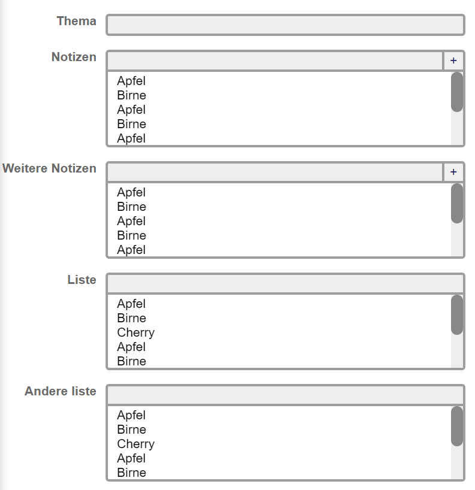

# jsForm

This is a simple and small library to create forms with JS. It provides additional form elements.



```js
import {jsForm} from "../src/jsForm.js";

jsForm
    .addInput('thema')
    .addAppendBox('notizen', undefined, ['Apfel', 'Birne', 'Apfel', 'Birne', 'Apfel', 'Birne', 'Apfel', 'Birne', 'Cherry'])
    .addAppendBox('notizen-2', 'Weitere Notizen', ['Apfel', 'Birne', 'Apfel', 'Birne', 'Apfel', 'Birne', 'Apfel', 'Birne', 'Cherry'])
    .addSearchBox('liste', undefined, ['Apfel', 'Birne', 'Cherry', 'Apfel', 'Birne', 'Cherry', 'Apfel', 'Birne', 'Cherry'])
    .addSearchBox('andere liste', undefined, ['Apfel', 'Birne', 'Cherry', 'Apfel', 'Birne', 'Cherry', 'Apfel', 'Birne', 'Cherry'])
    .render()
```
